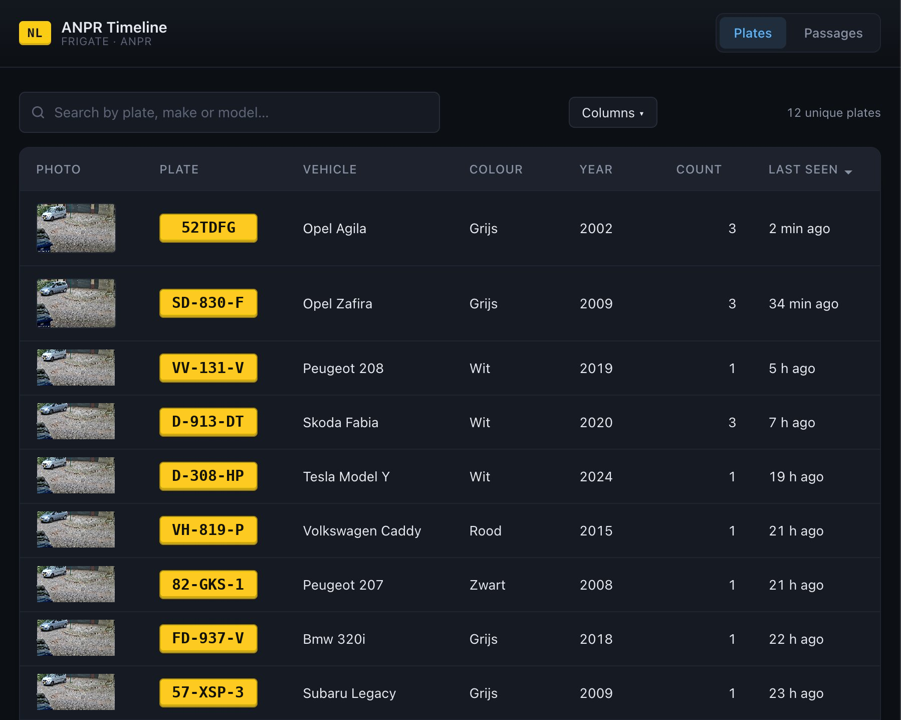
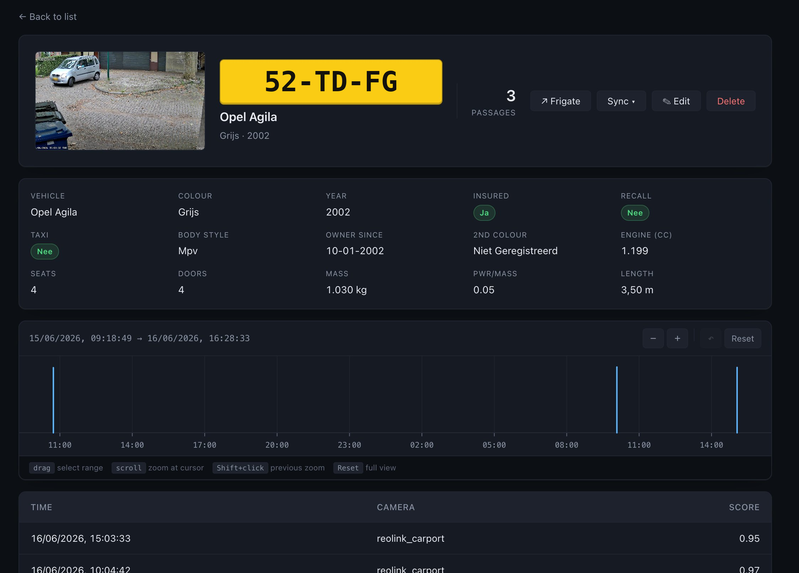

# Frigate ANPR Logger




Small self-hosted ANPR (license-plate) logger and dashboard. One container:

- ingests Frigate ANPR events over MQTT,
- enriches plates via a vehicle registry (Dutch RDW by default — add your own),
- exposes a JSON API + browser dashboard on `:8080`.

> Heads up: meant for a private LAN. **No authentication** — don't expose to
> the internet.

## Quick start

```bash
cp .env.example .env       # then open .env and set MQTT_HOST
docker compose up --build
```

Open <http://localhost:8090>.

## Development mode

Hot-reload on backend changes, browser-refresh on frontend changes — one
process serves the API and the dashboard at the same origin:

```bash
cd backend
uv sync
DB_PATH=../data/anpr.db \
    MQTT_HOST=<broker-host> \
    FRIGATE_URL=http://<frigate-host>:5000 \
    uv run uvicorn main:app --reload --reload-dir .
```

Replace `<broker-host>` and `<frigate-host>` with the IP or hostname of your
MQTT broker and Frigate instance respectively. `DB_PATH` points one level up
to the same `data/anpr.db` that the Docker setup uses, so dev mode shares
state with `docker compose`. `FRIGATE_URL` is optional — drop it to disable
snapshot capture and the dashboard simply won't show thumbnails.

Dashboard at <http://127.0.0.1:8000/ui/>. Edit `backend/*.py` → uvicorn
restarts. Edit `frontend/*` → browser refresh.

> No live Frigate feed? Copy `data/anpr.db` from a running instance into
> the same path, or `POST /sightings` to insert plates manually.

## `.env`

| Variable                  | Default                            | Notes                                                                                            |
| ------------------------- | ---------------------------------- | ------------------------------------------------------------------------------------------------ |
| `MQTT_HOST`               | `mosquitto`                        | **Set this.** Local dev pointing at a LAN broker → `<broker-host>`. Inside an existing compose stack next to a `mosquitto:` service → `mosquitto`. |
| `MQTT_PORT`               | `1883`                             |                                                                                                  |
| `MQTT_USER` / `MQTT_PASS` | —                                  | Leave blank for anonymous brokers.                                                               |
| `FRIGATE_TOPIC`           | `frigate/events`                   | Topic Frigate publishes events to. We act on `type=end` with a recognised plate.                 |
| `MIN_SCORE`               | `0.8`                              | Drop MQTT LPR events below this confidence.                                                      |
| `PAGE_SIZE`               | `50`                               | Plates per page on the dashboard. Bump for fewer Prev/Next clicks; hard cap is 1000.            |
| `FRIGATE_URL`             | _(unset)_                          | Optional. When set (e.g. `http://frigate:5000`), the first sighting of each plate caches a snapshot from Frigate's HTTP API. Leave empty to disable. |
| `FRIGATE_PUBLIC_URL`      | _falls back to `FRIGATE_URL`_      | Optional. Browser-reachable URL of Frigate's UI, used for the "View in Frigate" deep-link on the detail page (e.g. `http://<frigate-host>:5000`). Needed when the dashboard's browser can't resolve the container name in `FRIGATE_URL`. |

Copy `.env.example` to `.env`, edit `MQTT_HOST` (and `FRIGATE_URL` if you
want snapshot capture), and go — the rest has sensible defaults.

Running inside a bigger **docker-compose** stack next to a `mosquitto:`
service? Use the same `.env`; just flip the MQTT/Frigate values to the
container names (e.g. `MQTT_HOST=mosquitto`, `FRIGATE_URL=http://frigate:5000`)
— the inline comments in `.env.example` mark exactly which lines to change.

## Adding a country (vehicle-registry provider)

Plates are enriched via a *provider config*. Dutch RDW ships out of the box.
To add UK/DE/AT/etc., drop a JSON file in `./providers/` and list its name in
`./providers/index.json`. **No Python changes.**

The schema (HTTP method, plate placeholder, response path syntax, per-field
transforms) and a worked example are in
[`backend/providers/README.md`](backend/providers/README.md).

First-run UX: bind-mount an empty `./providers:/app/providers` and the
container seeds it from the shipped defaults on startup, so you have working
files to edit. `GET /providers` shows what's loaded.

## Architecture

```
   Frigate ──MQTT──▶ ┌──────────────────────────┐ ──HTTP──▶ vehicle registries
                    │   frigate-anpr-logger    │            (RDW, …)
                    │  FastAPI + MQTT thread   │
                    │  ──────────────────────  │
                    │  SQLite  /data/anpr.db   │
                    │  Dashboard  /ui          │
                    └──────────────────────────┘ :8080
```

One Python process. A background thread consumes Frigate events and writes
sightings; the FastAPI app serves the JSON API plus the frontend on the
same origin. SQLite holds everything — no external DB.

## HTTP API

The dashboard at `/ui/` is built on top of these. Open `/docs` on a running
instance for the full OpenAPI shape.

| Endpoint                              | What it does                                                       |
| ------------------------------------- | ------------------------------------------------------------------ |
| `GET /counts`                         | One row per unique plate joined with vehicle info, `last_seen` desc. |
| `GET /timeline/{plate}`               | Every passage of a plate, oldest first.                            |
| `GET /sightings?limit=&plate=`        | Flat list joined with vehicles, newest first (max `limit=1000`).   |
| `GET /sightings/{id}`                 | One sighting + vehicle info.                                       |
| `POST /sightings`                     | Manual insert. Triggers a provider lookup for new plates. 201.     |
| `PATCH /sightings/{id}`               | Partial update; plate change re-runs the provider lookup.          |
| `DELETE /sightings/{id}`              | Remove a sighting (false positive).                                |
| `GET /vehicles/{plate}`               | Stored vehicle row.                                                |
| `POST /vehicles/{plate}/refresh`      | Force a fresh provider lookup.                                     |
| `DELETE /vehicles/{plate}`            | Delete a cached vehicle row.                                       |
| `GET /providers`                      | Loaded vehicle-registry providers in resolution order.             |
| `GET /health`, `GET /healthz`         | `{"status":"ok"}` liveness probe.                                  |

Plates are normalised on input (uppercase, hyphens/spaces stripped), so
`"12-ABC-3"` and `"12ABC3"` hit the same record.

## SQLite

All data lives in a single SQLite file at `./data/anpr.db`. No external DB.

Schema changes go through a migration: append a `(version, description, fn)`
tuple to `MIGRATIONS` in [`scripts/migrate.py`](scripts/migrate.py). Every
backend start applies pending migrations — current DBs are a no-op. Never
edit a past migration.

```bash
python3 scripts/migrate.py /path/to/anpr.db           # apply pending
python3 scripts/migrate.py --status /path/to/anpr.db  # read-only check
```


## CLI companion

There's a stdlib-only terminal client that talks to the JSON API — handy for
quick `ssh`-into-the-box checks or scripting. No installation, no deps.

```bash
# Overview of all plates with counts + vehicle info
python3 scripts/anpr-cli.py

# Per-plate timeline
python3 scripts/anpr-cli.py 12ABC3

# Point it at a remote instance
API_URL=http://anpr.example.com:8090 python3 scripts/anpr-cli.py
```

## License

MIT. See [LICENSE](LICENSE).
